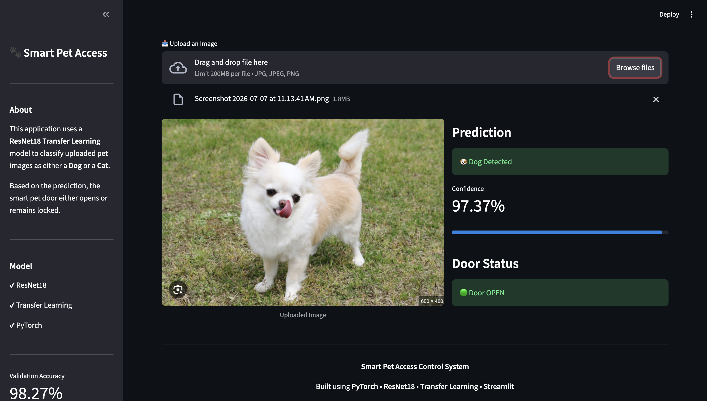
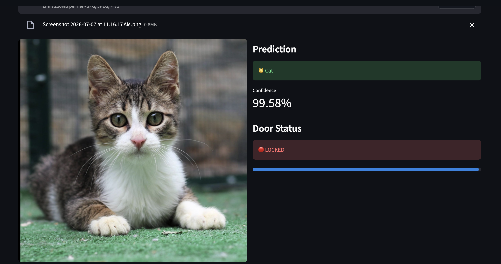
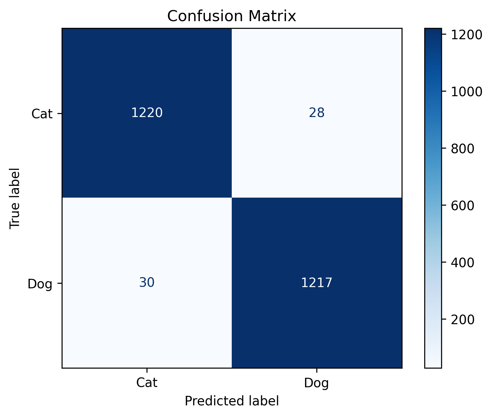

# 🐾 Smart Pet Access Control System

An AI-powered pet recognition system that classifies uploaded images as **Dog** or **Cat** using **ResNet18 Transfer Learning**. Based on the prediction, the system simulates an automated smart pet door that either **opens** or remains **locked**.

---
# 🐾 Smart Pet Access Control System


An AI-powered pet recognition system that classifies uploaded images as **Dog** or **Cat** using **ResNet18 Transfer Learning**.
---

## 🚀 Project Overview

This project demonstrates the use of **Deep Learning** and **Computer Vision** to build an intelligent pet access control system.

The model is trained using **Transfer Learning** on a pretrained **ResNet18** network. Users can upload an image through a **Streamlit** web application, and the model predicts whether the pet is a **dog** or a **cat**, displaying the confidence score and corresponding door status.

---

## 🖥️ Application Preview

### 🐶 Dog Prediction

<p align="center">

</p>

---

### 🐱 Cat Prediction

<p align="center">

</p>

---

### 📊 Model Evaluation

<p align="center">

</p>

---

# ✨ Features

- 🐶 Dog & Cat Image Classification
- 🧠 Transfer Learning using ResNet18
- 📷 Image Upload using Streamlit
- 📊 Confidence Score Prediction
- 🚪 Smart Door Access Simulation
- 📈 Model Evaluation using Accuracy, Precision, Recall & F1-Score
- 📉 Confusion Matrix Visualization
- 💻 Interactive Web Application

---

# 🧠 Model Architecture

- Backbone: **ResNet18**
- Framework: **PyTorch**
- Learning Strategy: **Transfer Learning**
- Output Layer: Binary Classification
- Loss Function: **BCEWithLogitsLoss**
- Optimizer: **Adam**

---

# 📊 Performance

| Metric | Score |
|---------|-------|
| Training Accuracy | **96.72%** |
| Validation Accuracy | **98.27%** |
| Test Accuracy | **97.68%** |
| Precision | **97.75%** |
| Recall | **97.59%** |
| F1 Score | **97.67%** |

---

# 🛠️ Tech Stack

- Python
- PyTorch
- TorchVision
- Streamlit
- OpenCV
- Pillow
- Matplotlib
- Scikit-learn

---

# ⚙️ Installation

Clone the repository

```bash
git clone https://github.com/Simrank967/Smart-Pet-Access-Control.git
```

Go to the project folder

```bash
cd Smart-Pet-Access-Control
```

Install dependencies

```bash
pip install -r requirements.txt
```

---

# ▶️ Train the Model

```bash
python train.py
```

---

# 📈 Evaluate the Model

```bash
python evaluation.py
```

---

# 🔍 Predict on an Image

```bash
python predict.py
```

---

# 🌐 Run the Streamlit Application

```bash
streamlit run app.py
```

---
